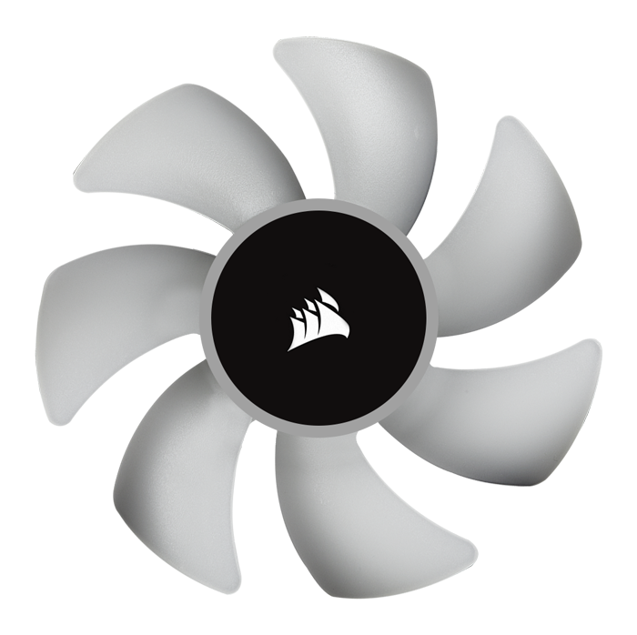

<html lang="en">
<head>
    <meta charset="UTF-8">
    <meta name="viewport" content="width=device-width, initial-scale=1.0">
    <title>Fan Animation</title>
    

    
</head>
<body>
    

        
    

    

        
        <button onclick="fan(1)">1</button>
        <button onclick="fan(2)">2</button>
        <button onclick="fan(3)">3</button>
    

</body>
</html>
